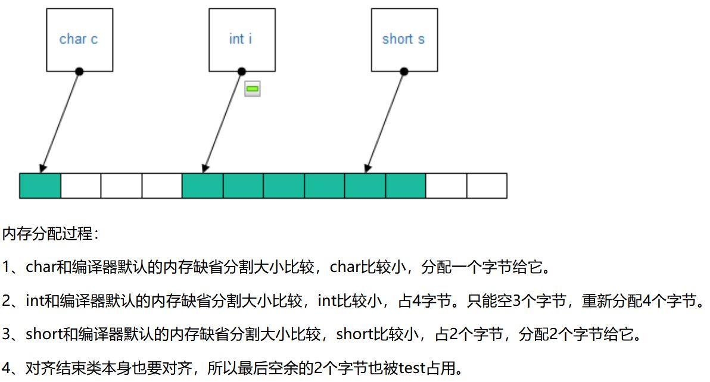
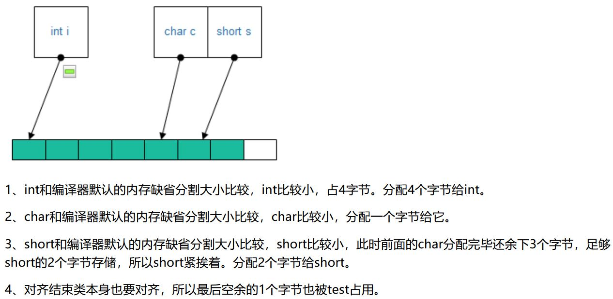

>抱佛脚一时爽，一直抱佛脚一直爽！这篇文章总结常见的c++面试问题~因为是抱佛脚，所以结构上没有什么逻辑...
>
>参考链接：[Waking-Up](https://github.com/wolverinn/Waking-Up) [CycNotes](https://github.com/CyC2018/CS-Notes) [牛客网](https://www.nowcoder.com/)
[TOC]

# 面向对象的三大特点

封装、继承、多态

# c++中多态的实现

| 多态类型   | 时期        | 栗子                         |
| ---------- | ----------- | ---------------------------- |
| 重载多态   | 编译期      | 函数重载、运算符重载         |
| 子类型多态 | 运行期      | 虚函数                       |
| 参数多态   | 编译期      | 函数模板、类模板             |
| 强制多态   | 编译/运行期 | 基本类型转换、自定义类型转换 |

# static

### 全局静态变量

- 存在静态存储区，整个程序运行期间都存在
- 默认初始值为0
- 作用域：从定义处到文件结尾；在声明它的文件之外不可见（**非静态的全局变量是可以外链接的**）

### 局部静态变量

- 存在静态存储区，整个程序运行期间都存在
- 默认初始值为0
- 作用域：定义它的函数/语句块内（**离开作用域后并未被销毁，而是驻留在内存中，只是不能访问，直到该函数/语句块再次被调用，此时它的值不变**）

### 静态函数

- 作用域：从定义处到文件结尾；在声明它的文件之外不可见，其他文件可以定义同名函数不会冲突（**非静态函数的定义和声明默认是extern的**）
- 使用注意：不要在头文件中声明static的全局函数；不要在cpp文件中声明非static的全局函数
- **静态函数不能是虚函数**（static静态函数没有this指针，通过this指针才能找到虚函数表）

### 类的静态成员

- 初始化：必须在类声明的外部初始化；初始化时不能加static
- 内存分配：在类外初始化时分配内存
- 访问：可以通过对象或类来访问

### 类的静态成员函数

- 访问：只能访问类的静态成员和静态成员函数
- 调用：可以通过对象或类来调用
- this指针：没有this指针
- 定义：必须在类外定义；定义时不能加static

### static的作用小结

- 对函数和全局变量：标识符的链接属性由默认的external变为internal
- 对局部变量：存储区域由栈变为静态存储区；生存期变为整个程序运行期间都存在
- 对类成员：所有对象共享

# c++ vs c

- c++面向对象，c面向过程
- c++有封装、继承、多态三种特性

# 类型转换

### 显示类型转换

| 转换             | 转换完成时期 | 适用对象   | 作用                                                         |
| ---------------- | ------------ | ---------- | ------------------------------------------------------------ |
| const_cast       | 编译期       | 指针、引用 | 去掉const/volatile                                           |
| static_cast      | 编译期       |            | 非const转const、基础类型转换、void*转指针、子类转父类 **可用于父类转子类但不安全，父类转自类应该用dynamic_cast** **告诉编译器不在乎精度损失** |
| dynamic_cast     | 运行期       | 指针、引用 | 含有虚函数的父类，在执行到语句时动态转为子类                 |
| reinterpret_cast | 编译期       |            | 不安全，尽量少用                                             |

### 隐式类型转换

- 内置类型：低精度变量可隐式转换为高精度变量
- 对象：若某对象的构造函数只有一个形参a，则其他函数在以该对象为实参进行传递时，可以直接传a，编译器将自动调用构造函数，把a隐式转换为一个临时对象

# 指针 vs 引用

- 指针是变量（有自己的存储空间），引用是别名
- 指针初始化为nullptr或不初始化，引用必须初始化为已有对象的引用
- 指针可以改变指向的对象，引用不能改变引用的对象
- sizeof指针是4，sizeof引用是被引用对象的大小

# 智能指针

### 概述

- 避免忘记释放堆空间的问题
- 是对普通指针的封装
- 会在析构函数中释放申请的内存

### auto_ptr

- 已被c++ 11弃用
- 采用独占模式
- p2 = p1会让p2剥夺p1对指向对象的所有权，编译不报错，但运行时再访问p1会报错

### unique_ptr

- 替换auto_ptr
- 独占模式：同一时间只有一个智能指针可以指向该对象
- p2 = p1会让p2剥夺p1对指向对象的所有权，若p1是右值，编译不报错；否则报错

### shared_ptr

- 多个智能指针可以指向同一对象，该对象会在计数为0时释放资源
- 一些函数：swap（交换两个指针所拥有的对象）；reset（放弃对象的所有权，计数--）；get（返回普通指针）
- 不能用普通指针初始化shared_ptr，因为shared_ptr是一个类，必须通过make_shared函数或者shared_ptr的构造函数

### weak_ptr

- 作用：当shared_ptr相互引用构成死锁时（比如两个对象相互使用一个shared_ptr成员变量指向对方），可以把其中一个改为weak_ptr
- 只可以从一个shared_ptr或另一个weak_ptr来构造
- 不会引起use_count的变化
- shared_ptr可以直接赋值给weak_ptr；weak_ptr要调用lock函数才能转化为shared_ptr
- weak_ptr必须转化为shared_ptr才能访问指向的对象

# 野指针

指向一个已删除的对象或未申请访问受限内存区域的指针

# 段错误

访问非法内存地址，如使用野指针、试图修改字符串常量的内容

# 虚函数

### 为什么析构函数必须是虚函数

析构函数是虚函数可以保证使用基类指针指向子类对象时，释放基类指针时可以释放掉子类的空间，防止内存泄漏

### 为什么c++默认的析构函数不是虚函数

虚函数需要额外的虚函数表和虚表指针，占用内存，对于不会被继承的类来说是一种浪费

### 为什么构造函数不能是虚函数

在调用构造函数时，虚表指针并没有在对象的内存空间中，必须要构造函数调用完成后才会形成虚表指针

### 纯虚函数

是一种特殊的虚函数，在基类中不能对虚函数给出有意义的实现，而把它声明为纯虚函数，它的实现留给该基类的派生类去做

### 虚函数表与虚函数指针

- 有虚函数的对象的内存最开始是虚函数指针，指向数据段中的虚函数表
- 虚函数表是一个函数指针数组，其中的函数指针指向要执行的函数的入口地址
- 增加一个虚函数, 只是简单地向该类对应的虚函数表中增加一项而已, 并不会影响到类对象的大小以及布局情况
- 子类继承父类时，会继承它的虚函数表，但若它重写了父类的虚函数，会把继承到的虚函数表中的函数替换为重写的函数
- 同一个类的不同实例共用同一份虚函数表（父类和子类是两个类，所以有两张虚函数表）
- 虚函数表是编译时期创建好的

### 运行时类型检查 RTTI

- 虚函数表的-1位置存放了指向type_info的指针
- 对于存在虚函数的类型，typeid和dynamic_cast都会查询type_info

# 析构函数

- 只能有一个析构函数，不能重载
- 不能有参数和返回值
- 即使自定义了析构函数，编译器也会合成析构函数，执行时，先调用自定义析构函数再调用合成的析构函数

# 拷贝构造函数

其形参不能是值传递，否则，调用拷贝构造函数的时候，实参传递给形参需要调用拷贝构造函数，一直循环，直到栈满

# i++ vs ++i

- i++返回右值，++i返回左值
- 因为没有生成临时变量，所以++i更快

# main函数

### main函数执行前执行了什么

- 设置栈指针
- 初始化数据段内容
- 初始化BSS段内容：赋默认初始值或调用默认构造函数
- 将main函数的参数（argc、argv）传给main函数
- 如果使用gcc，可以用\__attribute__((constructor)) void func() 编写想在main执行前执行的代码

### main函数执行后执行了什么

- 全局对象的析构函数
- 被注册到onexit的函数 // 注册方法：onexit( fn1 );
- 如果使用gcc，可以用\__attribute__((destructor))void after()

### main的参数

- argv中的第一个元素要么指向程序名字，要么指向空字符串

# const

### 初始化

常量在定义时必须初始化

### 存放位置

- 局部常量：栈
- 全局常量：数据段
- 字面值常量：代码段的常量存储区

### 常成员函数

- 表示调用该函数不会对对象做出任何更改
- const/非const对象均可调用
- 只有成员函数才可以是常函数
- 常变量、指向常变量的指针\引用只能调用常成员函数
- 常成员函数中的 this 是 const T *const 型，即 this 指向常量

### const vs #define

- const有数据类型，在编译阶段进行替换，可以进行类型安全检查；#define在预编译阶段替换，没有数据类型检查，只进行字符替换，不计算、不做表达式求解
- const给出相应的内存地址，在程序运行过程中只有一份拷贝；define给出立即数，可能会有多个拷贝

### extern

const变量默认是local to the file的，所以如果要多个文件共享一个const变量，需要在定义它时也加上extern

### const & *

- const T x、T const x 
	x是常变量，top-level const
- const T& x、T const& x 
	引用常量的引用，low-level const
- const T* x、T const* x
	指向常量的指针，low-level const
- T* const x 
	常指针，top-level const
- const T* const x、T const * const x
	既不能修改其指向对象也不能修改其自身指向位置的指针
- const T*& x、T const*& x 
	对指向常量的指针的引用
- T* const& x 
	对T*的常引用
- T const * const & x 
	对const T*的常引用

### top/low-level const

- 复制top-level const的对象时，其const属性会被忽略

- 复制low-level const的对象时，其const属性不会被忽略
- auto类型推断时，忽略top-level const，保留low-level const

### constexpr

- 字面量和被常表达式初始化的常对象是常表达式
- 其值不能改变，在编译时evaluate
- constexpr指针/引用只能指向/引用有固定地址的变量：即存在数据段/BSS段的
- constexpr函数是隐式inline的：the compiler will replace a call to a constexpr function with its resulting value

### 构造函数不能是常函数

定义一个常对象时，the object does not assume its “constness” until after the constructor completes the object’s initialization，因此，constructors can write to const objects during their construction

# new/delete vs malloc/free

- 前者是c++关键字，后者是c关键字
- 使用malloc时必须指明申请的空间大小，new不需要
- 前者会调用构造函数和析构函数，后者不会
- new是操作符，可以重载；malloc是库函数
- new失败抛出异常，malloc失败返回NULL
- malloc返回的指针需要强转（因为返回的是void*）

# malloc原理

### 申请小内存时

- 遍历空闲块链表，分配一块合适的空闲块
- 空闲块链表：一个双向链表把所有空闲块连接起来

### 申请大内存时

- 使用系统调用mmap分配
- 在堆和栈中间的文件映射区找一块空闲的虚拟内存，初始值为0

### 注意

- 分配的都是虚拟内存，没有分配物理内存
- 在第一次访问已分配的虚拟地址空间的时候，发生缺页中断，操作系统负责分配物理内存，然后建立虚拟内存和物理内存之间的映射关系

# STL

### sort

- 底层算法：内省排序
- 首先从快速排序开始，当递归深度超过一定深度（深度为排序元素数量的对数值）后转为堆排序

### allocator

- 用于封装STL容器在内存管理上的底层细节
- 在堆上分配空间
- alloc::allocate()负责配置内存，::construct()负责构造对象，alloc::deallocate()负责释放内存，::destroy()负责析构对象
- 采用两级配置器：
  - 分配大内存时，使用第一级空间配置器，调用malloc的mmap
  - 分配小内存时，使用第二级空间配置器，采用内存池技术，通过空闲链表管理内存，内存池中有16个空闲链表，每个链表中的节点大小分别为8、16、24...128

### 迭代器失效

- 序列容器vector/deque：iter后的每个元素的迭代器都会失效，iter后的每个元素都会往前移动，erase返回下一个有效的迭代器
- 关联容器map/set：iter失效，iter后的迭代器不会失效（因为用的是红黑树），earse不会返回下一个有效的迭代器
- list：iter失效，iter后的迭代器不会失效，erase返回下一个有效的迭代器

### 迭代器 vs 指针

迭代器是类模板，是指针的封装，重载了指针的操作符，提供了比指针更高级的行为（比如根据不同类型的数据结构实现不同的++和--）

### resize vs reserve

- resize改变的是size，若原size小于len，则新增0作为元素
- reserve改变的是capacity，若原cap小于len，则重新分配一块可以存len个对象的空间，把原vector拷贝过来，销毁之前的内存

### map

- 底层是红黑树
- const map中不允许用[]

### set

- 底层是红黑树
- 迭代器不允许修改元素

### vector

- 底层是动态数组
- 任何改变容器大小的操作都可能使迭代器失效
- 引用不是对象，所以无法把vector实例化为引用
- vector<noDefault> v2(10); // error: must supply an element initializer

### list

- 底层是双向链表
- prev next

### unordered_map

- 底层是哈希表（数组）+链表
- 通过拉链法解决哈希冲突，用头插法新增元素
- 链表大小超过8会转为红黑树

### unordered_set

- 与unordered_map类似，集合元素是key

### deque

- 底层：以分段连续空间组合而成，随时可以增加一段新空间连接起来 (list和vector综合)
- stack、queue

### priority_queue

- 底层是vector（因为堆是完全二叉树）
- 默认用max_heap

# 编译过程

- 预处理阶段：对include的头文件、宏定义语句进行分析和替换，去除注释，生成预编译文件
- 编译阶段：把预编译文件经过词法分析、语法分析、语义分析转换为汇编代码，生成汇编文件
  **先编译 member declarations，再编译 member function bodies**
- 汇编阶段：把汇编文件转换为目标机器指令，生成可重定位目标文件（含代码段、数据段）
- 链接阶段（静态链接）：将多个目标文件及所需要的库连接成最终的可执行目标文件（即把每个符号的定义与一个内存位置关联起来）
  **注意：动态链接在运行时才被载入；不同应用程序调用相同的库时，内存只需要有一份该共享库的实例，避免空间浪费**

# 静态链接 vs 动态链接

### 静态链接

在编译时把.o文件链接到目标程序中，即把每个符号的定义与一个内存位置关联起来

### 动态链接

- 在运行时链接.so文件
- 某个程序在运行中要调用某个动态链接库函数的时候，操作系统首先会查看所有正在运行的程序，看在内存里是否已有此库函数的拷贝了。如果有，则让其共享那一个拷贝；只有没有才链接载入。
- 在程序运行的时候，被调用的动态链接库函数被安置在内存的某个地方，所有调用它的程序将指向这个代码段

# "" vs <>

预处理阶段查找头文件的路径不同

- ""：当前头文件目录、编译器设置的头文件路径（可使用-I显式指定）、系统变量C_INCLUDE_PATH指定的头文件路径
- <>：编译器设置的头文件路径（可使用-I显式指定）、系统变量C_INCLUDE_PATH指定的头文件路径

# c++中每个进程的虚拟内存

从上（低地址）至下（高地址）依次是：

- 内核空间（1G）
  - 用户代码无法访问这一块，通过系统调用进入内核态后才能访问
  - 所有进程共享一个内核空间
  - 由于内核态空间与用户态空间采用了不同的映射机制，虽然内核态只有1GB的虚拟地址空间，但是它可以访问所有的物理内存地址
- 用户空间（3G）
  - 代码段（正文段）：由exec从程序文件中读入
    - 常量存储区（只读存储区）：存储字符串常量
    - 文本区：存储程序的机器代码
  - 数据段（已初始化数据区）：由exec从程序文件中读入
    - 存储已初始化的全局变量和静态变量
  - BSS段：由exec初始化为0
    - 存储未初始化的全局变量和静态变量
    - 程序结束后资源由系统自动释放
    - 并不占用可执行文件的大小（**即：存储在磁盘中的可执行文件只包括代码段和数据段**），它是由链接器获取内存的
  - 堆区
    - 大小不确定
    - 由程序员申请、释放
    - 申请堆空间时库函数按照一定的算法搜索可用的足够大的空间，所以效率比栈低很多
  - 文件映射区
    - 存储动态链接库等文件映射、申请大内存时mmap函数分配的对象
  - 栈区
    - 大小确定
    - 能从栈中获取的空间较小
    - 存储函数的返回地址、参数、局部变量、返回值
    - 由编译器自动释放
  - 命令行参数和环境变量

# 内存泄漏的原因

- 用了malloc/new/reallco，没用free/delete，造成堆内存泄漏
- 用了系统分配的资源handle/socket等，没释放，造成系统资源泄漏
- 没有将基类的析构函数定义为虚函数，子类的资源没有正确释放

# c++ 11新特性

- auto关键字：编译器可以进行自动类型推断，但不能用于函数传参及数组类型的推断
- nullptr关键字
- 智能指针
- 可以使用初始化列表来对类进行初始化
- 右值引用：实现移动语义和完美转发
- atomic原子操作用于多线程资源互斥操作
- 新增了一些STL容器：unordered_map unordered_set array等
- lambda表达式：定义一个匿名函数，可以捕获上下文中的变量
- 可变参数模板

# nullptr vs NULL

- NULL是宏定义，值为0，含义是void*，不能转换为任意类型的指针
- nullptr是字面值常量，可以转换为任意类型的指针

# 可变参数模板

- 可表示任意数目、任意类型的参数
- Template<class ... T>
  void func(int n, T ... args) 

# 右值引用的作用

### 移动语义

用右值引用作为形参类型，实现移动构造函数，将形参（是一个临时对象）的指针成员变量指向nullptr，将新构造的对象的指针成员变量指向要指向的数据

### 完美转发

- 指传入转发函数（函数模板中调用的函数模板）的是左（右）值对象，那目标函数（转发函数通过类型推断得到）就能获得左（右）值对象
- 需要将转发函数和目标函数的形参都设置为右值引用，或者在调用转发函数时，用forward<T>(t)作为实参
- forward<T>(t)的作用：当T是左（右）值引用时，t被转为T类型的左（右）值

# 内联函数

- 关键字inline必须与函数定义放在一起才能使函数成为内联函数，仅仅将inline放在函数声明前面不起任何作用
- inline函数可以多次定义，但每次定义必须是一样的
- 定义在类中的函数是默认inline的
- 当虚函数表现多态性的时候不能内联
- 与宏定义的区别：宏定义是预编译时替换的，没有类型检查；内联函数是在编译时替换的，有类型检查
- 适用场景：一个函数不断地被重复调用，且函数只有简单几行，且函数不包括for,while,switch语句
- 与static的区别：inline 因为编译阶段代码展开导致函数本文件可见, static 符号属性为local 本文件可见
- 优点
  - 在被调用处进行代码展开，省去了参数压栈、栈帧开辟与回收，结果返回等，从而提高程序运行速度
  - 相比宏函数来说，在代码展开时，会做安全检查或自动类型转换（同普通函数）
  - 在类中声明同时定义的成员函数，自动转化为内联函数，因此内联函数可以访问类的成员变量，宏定义则不能
  - 内联函数在运行时可调试，而宏定义不可以
- 缺点
  - 代码膨胀耗时间、耗空间
  - inline 函数无法随着函数库升级而升级。inline函数的改变需要重新编译，不像 non-inline 可以直接链接
  - 是否内联，程序员不可控。内联函数只是对编译器的建议，是否对函数内联，决定权在于编译器
- 编译器对inline的处理步骤
  - 把内联函数的代码副本放置在每一个调用它的地方（**其他函数都是运行时才被替代**）
  - 为inline 函数中的局部变量分配内存空间
  - 将 inline 函数的的输入参数和返回值映射到调用该函数的局部变量空间中
  - 如果 inline 函数有多个返回点，将其转变为 inline 函数代码块末尾的分支（使用 GOTO）

# 内存溢出 vs 内存泄漏

### 内存溢出

- 程序申请内存时，没有足够的内存空间内供其使用
- 栗子
  - 一次从db中取出过多数据
  - 有死循环产生过多重复的对象实体
  - 递归调用层次过多
  - 局部数组过大
  - 指针或数组越界

### 内存泄漏

程序未释放已申请的内存空间

# 为什么栈的效率比堆高

- 栈是OS提供的数据结构，计算机底层对栈提供了一系列支持：分配专门的寄存器存储栈的地址，压栈和入栈有专门的指令执行
- 堆是c/c++函数库提供的，机制复杂，需要一些分配内存、合并内存、释放内存的算法

# 各种情况的初始值

### 内置类型和array

- 若在块内、非static、未给初始值：执行默认初始化，其初始值未定义
- 否则：执行值初始化，初始值为0

### 复合类型

- 引用：声明时必须初始化
- 指针：执行默认初始化，其初始值未定义

### 静态变量

- 执行值初始化，初始值为0

### STL对象/类

- 无论是默认初始化还是值初始化，都调用其默认构造函数，初始值都一般为空对象（比如 string 初始值是 ""）

### 类中未初始化变量

- 执行默认初始化，其初始值未定义

### 初始化时初始值数量小于其维度的数组

- 剩下的元素会进行值初始化，初始值为0

### 使用形如T()的表达式显示请求值初始化的

- 执行值初始化

### 结构体

- 未初始化的成员会有默认的初始值

# decltype

- 使用函数时，编译器并未调用f，但使用了f的返回类型
- 加括号-->变为引用
- 保留top-level const
- 对表达式使用decltype时，若表达式为左值，则结果为引用，若表达式为右值，则结果为指针

# array做形参

- 因为不能复制array，所以无法通过传值的方法，而是传指针
- 在函数的形参列表里指定数组的成员个数是没有意义的，比如const int [10]的声明编译器自动处理为const int *
- 不能定义元素是引用的array：引用没有自身的地址，不占用内存空间，因此，声明引用数组没有办法分配内存空间

# 临时变量产生的时机

- 值传递时
- 强制/隐式类型转换时
- 常引用传递且需要进行类型转换时
- ++ --后置时

# 重载

- must differ in the number or the type(s) of their parameters
- 有无top-level const不影响type difference
- 类中的const与nonconst成员函数可以重载，因为this指针类型不同

# 重载 vs 重写 vs 隐藏

- 区别

  

- 当参数列表不同时，无论基类中的函数是否被virtual修饰，基类函数都是被隐藏，而不是被重写；参数相同时，若基类函数没有关键字virtual，此时基类函数被隐藏，若有则被重写

# 声明 vs 定义

- 声明是给编译器用的，定义是给连接器用的
- 代码中可以调用只声明未定义的函数，是因为在调用函数处，编译器会产生调用函数的代码，但编译器并不管函数的具体实现（即定义）在哪里，链接器才需要查找函数的实现代码并与函数调用代码对上
- 与普通函数不同，编译器会生成实例化后的模板的代码，所以the compiler needs to have the code that defines a function template or class template member function
  - 所以headers for templates typically include definitions as well as declarations
  - when the compiler sees the definition of a template, it does not generate code（但会检查模板的语法等）；编译器 generates code only when we instantiate a specific instance of the template
- 编译器给对象分配内存的前提是知道其大小，所以只声明而未定义的类类型只能用于：
  - define pointers or references to such types
  - declare (but not define) functions that use it as a parameter or return type

# 友元

一个类的友元函数/类可以access its nonpublic members

# 继承中的访问控制

- public继承：父类中的public、protected和private属性在子类中不发生改变
- protected继承：父类中的public属性在子类中变为protected，父类中的protected和private属性在子类中不变
- private继承：父类中的三种访问属性在子类中都会变成private

# =delete vs =default

- =delete：告知编译器不生成函数默认的缺省版本
- =default：告知编译器生成函数默认的缺省版本

# 空指针 vs 未初始化指针

- 空指针可以确保不指向任何对象或函数，未初始化指针可能指向任何地方

- 访问空指针指向的空间，会发生：
  - 令指针=NULL会让它存放地址0x0
  - Linux 中，每个进程空间的 0x0 虚拟地址开始的线性区都会被映射到一个用户态没有访问权限的页上
  - 编译器把空指针当做 0 对待，开心地让你去访问0x0
  - 缺页异常处理程序被调用，因为在 0x0 的页没有在物理内存里面
  - 缺页异常处理程序发现你没有访问的权限
  - 内核发送 SIGSEGV 信号给进程，该信号默认是让进程自杀

# this指针

this 并不是一个常规变量，而是个右值，所以不能取得 this 的地址（不能 &this）

# 定义只能在堆（栈）上生成对象的类

### 只能在堆上

将析构函数设为私有：编译器在为类对象分配栈空间时，会先检查类的析构函数的访问性。若析构函数不可访问，则不能在栈上创建对象

### 只能在栈上

将 new 和 delete 重载为私有

# 内存对齐

### 对齐规则

- 第一个数据成员放在offset为0的地方，以后每个数据成员的对齐按照#pragma pack指定的数值和这个数据成员自身长度中，比较小的那个进行
- 在数据成员完成各自对齐之后，类(结构或联合)本身也要进行对齐，对齐将按照#pragma pack指定的数值和结构(或联合)最大数据成员长度中，比较小的那个进行
- \#pragma pack(n)作为一个预编译指令，设置按多少个字节对齐；但编译器只会按照1、2、4、8、16的方式分割内存。若n为其他值，是无效的

### 栗子（[博客园](https://www.cnblogs.com/zrtqsk/p/4371773.html)）

# go实现的并发模型

### 多线程并发

cpp中也有，以共享内存的方式来通信

### csp：以通信的方式来共享内存

- 通过goroutine和channel实现，channel是goroutine之间通信的管道
- 传数据用channel<-data，取数据用<-data，它俩成对出现；传和取都是阻塞的，直到另外goroutine取/传为止
- main()本身就是一个goroutine