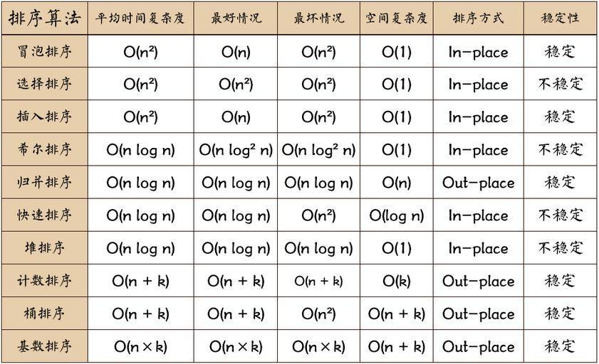

# SQL

### 删除重复邮箱

```sql
DELETE p1
FROM Person p1,
    Person p2
WHERE p1.Id > p2.Id
AND p1.Email = p2.Email
```
### 第二高薪水
```sql
SELECT(
SELECT distinct salary 
FROM Employee
ORDER BY salary DESC
LIMIT 1, 1) AS SecondHighestSalary
```
### 组合两个表
```sql
SELECT Person.FirstName AS FirstName, Person.LastName AS LastName, Address.City AS City, Address.State AS State
FROM Person LEFT JOIN Address
ON Person.PersonId = Address.PersonId
```
### 查找工资第 N 高的员工
```sql
CREATE FUNCTION getNthHighestSalary ( N INT ) RETURNS INT BEGIN

SET N = N - 1;
RETURN ( 
    SELECT ( 
        SELECT DISTINCT Salary 
        FROM Employee 
        ORDER BY Salary DESC 
        LIMIT N, 1 
    ) 
);

END
```
### 分数排名

```sql
select a.Score as Score,
(select count(distinct b.Score) from Scores b where b.Score >= a.Score) as Rank
from Scores a
order by a.Score DESC
```
# 多线程

### 打印0102...0n

```cpp
#include <semaphore.h>
class ZeroEvenOdd {
private:
    int n;
    sem_t zeroSem;
    sem_t oddSem;
    sem_t evenSem;
    
public:
    ZeroEvenOdd(int n) {
        this->n = n;
        sem_init(&zeroSem, 0, 1);
        sem_init(&oddSem, 0, 0);
        sem_init(&evenSem, 0, 0);
    }

    // printNumber(x) outputs "x", where x is an integer.
    void zero(function<void(int)> printNumber) {
        for (int i = 0; i < n; ++i) {
            sem_wait(&zeroSem);
            printNumber(0);
            if (i % 2 == 0) sem_post(&oddSem);
            else sem_post(&evenSem);
        }
    }

    void even(function<void(int)> printNumber) {
        for (int i = 2; i <= n; i += 2) {
            sem_wait(&evenSem);
            printNumber(i);
            sem_post(&zeroSem);
        }
    }

    void odd(function<void(int)> printNumber) {
        for (int i = 1; i <= n; i += 2) {
            sem_wait(&oddSem);
            printNumber(i);
            sem_post(&zeroSem);
        }
    }
};
```

### 打印1 2 fizz 4 buzz 6 7 8 fizz buzz 11 fizz 13 14 fizzbuzz

```cpp
#include <semaphore.h>
class FizzBuzz {
private:
    int n;
    sem_t s3;
    sem_t s5;
    sem_t s15;
    sem_t sx;
public:
    FizzBuzz(int n) {
        this->n = n;
        sem_init(&s3, 0, 0);
        sem_init(&s5, 0, 0);
        sem_init(&s15, 0, 0);
        sem_init(&sx, 0, 1);
    }

    // printFizz() outputs "fizz".
    void fizz(function<void()> printFizz) {
        for (int i = 1; i <= n; ++i) {
            if (i % 3 == 0 && i % 5) {
                sem_wait(&s3);
                printFizz();
                if ((i + 1) % 5 == 0) sem_post(&s5);
                else sem_post(&sx);
            }
        }
    }

    // printBuzz() outputs "buzz".
    void buzz(function<void()> printBuzz) {
        for (int i = 1; i <= n; ++i) {
            if (i % 5 == 0 && i % 3) {
                sem_wait(&s5);
                printBuzz();
                if ((i + 1) % 3 == 0) sem_post(&s3);
                else sem_post(&sx);
            }
        }
    }

    // printFizzBuzz() outputs "fizzbuzz".
	void fizzbuzz(function<void()> printFizzBuzz) {
        for (int i = 1; i <= n; ++i) {
            if (i % 15 == 0) {
                sem_wait(&s15);
                printFizzBuzz();
                sem_post(&sx);
            }
        }
    }

    // printNumber(x) outputs "x", where x is an integer.
    void number(function<void(int)> printNumber) {
        for (int i = 1; i <= n; ++i) {
            if(i % 3 && i % 5) {
                sem_wait(&sx);
                printNumber(i);
                if ((i + 1) % 3 == 0 && (i + 1) % 5 == 0) sem_post(&s15);
                else if ((i + 1) % 3 == 0) sem_post(&s3);
                else if ((i + 1) % 5 == 0) sem_post(&s5);
                else sem_post(&sx);
            }
        }
    }
};
```

### h2o生成

```cpp
class H2O {
public:
    H2O() {
        
    }

    void hydrogen(function<void()> releaseHydrogen) {
        unique_lock<mutex> lk(m);
        cond.wait(lk, [this] {return this->h < 2;});
        releaseHydrogen();
        ++h;
        if (h + o == 3) {
            h = 0;
            o = 0;
        }
        cond.notify_all();
    }

    void oxygen(function<void()> releaseOxygen) {
        unique_lock<mutex> lk(m);
        cond.wait(lk, [this] {return this->o < 1;});
        releaseOxygen();
        ++o;
        if (h + o == 3) {
            h = 0;
            o = 0;
        }
        cond.notify_all();
    }
private:
    mutex m;
    condition_variable cond;
    int o = 0;
    int h = 0;
};
```

### 哲学家进餐

```cpp
class DiningPhilosophers {
private:
    pthread_mutex_t forks[5];
public:
    DiningPhilosophers() {
        for(int i = 0; i < 5; i++) pthread_mutex_init(forks + i, NULL);
    }

    void wantsToEat(int philosopher,
                    function<void()> pickLeftFork,
                    function<void()> pickRightFork,
                    function<void()> eat,
                    function<void()> putLeftFork,
                    function<void()> putRightFork) {
        int left_hand = philosopher, right_hand = (philosopher + 1) % 5;    //左右手序号
        int ret1 = 1, ret2 = 1;
        while(ret1 || ret2) {                                               //尝试同时锁两个直到成功
            if(ret1 == 0) pthread_mutex_unlock(forks + left_hand);          //锁失败锁住的打开
            if(ret2 == 0) pthread_mutex_unlock(forks + right_hand);
            ret1 = pthread_mutex_trylock(forks + left_hand);                //继续尝试 
            ret2 = pthread_mutex_trylock(forks + right_hand);               //pthread_mutex_trylock 成功会返回0
        }
        pickLeftFork();
        pickRightFork();
        eat();
        putLeftFork();
        putRightFork();
        pthread_mutex_unlock(forks + left_hand);                            //全部解锁
        pthread_mutex_unlock(forks + right_hand);
    }
};
```

### 生产者消费者

```cpp
#include<queue>
#include<semaphore.h>
class BoundedBlockingQueue {
public:
    
    sem_t p, c, mut;
    queue<int> q;
    
    BoundedBlockingQueue(int capacity) {
        sem_init(&p, 0, capacity); // 生产者
        sem_init(&c, 0, 0); // 消费者
        sem_init(&mut, 0, 1); // 锁
    }
    
    void enqueue(int element) {
        sem_wait(&p);
        sem_wait(&mut);
        q.push(element);
        sem_post(&mut);
        sem_post(&c);
    }
    
    int dequeue() {
        
        sem_wait(&c);
        sem_wait(&mut);
        int ans = q.front();
        q.pop();
        sem_post(&mut);
        sem_post(&p);
        return ans;
        
    }
    
    int size() {
        sem_wait(&mut);
        int ans = q.size();
        sem_post(&mut);
        return ans;
    }
};
```

# 图算法

- 最小生成树

  每次选择不同森林之间最小的边

- 某顶点到所有点的最短路径

  https://www.cnblogs.com/kamimxr/p/11213019.html

# 二分查找

### 查找局部峰值

```cpp
int findPeakElement(vector<int>& nums) {
    int left = 0, right = nums.size() - 1; // right必须是n - 1，不能是n，防止mid + 1越界
    while (left < right) { // 注意是小于！
        int mid = left + (right - left) / 2;
        if (nums[mid] < nums[mid + 1]) left = mid + 1;
        else right = mid;
    }
    return right;
}
```

### 旋转数组找最小数（数组中有重复值）

```cpp
int minArray(vector<int>& numbers) {
  int left = 0, right = (int)numbers.size() - 1;
  while (left < right) {
    int mid = left + (right - left) / 2;
    if (numbers[mid] > numbers[right]) left = mid + 1;
    else if (numbers[mid] == numbers[right]) --right; // 处理重复值的情况
    else right = mid;
  }
  return numbers[right];
}
```

### 寻找重复数（lc287）

```cpp
int findDuplicate(vector<int>& nums) {
    int left = 1, right = nums.size(); // 这里的left和right并不是nums的index，而是表示区间[1,n]；right = num.size() - 1也可以
    while (left < right) {
        int mid = left + (right - left) / 2, cnt = 0;
        for (int num : nums) {
            if (num <= mid) ++cnt;
        }
        if (cnt <= mid) left = mid + 1;
        else right = mid; // 因为会令right = mid，所以必须是while (left < right)，否则构成死循环
    }    
    return right;
}
```

# dfs

### 课程表（lc207）

```cpp
class Solution {
public:
    bool canFinish(int numCourses, vector<vector<int>>& prerequisites) {
        vector<vector<int>> graph(numCourses, vector<int>());
        vector<int> visit(numCourses);
        for (auto a : prerequisites) {
            graph[a[1]].push_back(a[0]);
        }
        for (int i = 0; i < numCourses; ++i) {
            if (!canFinishDFS(graph, visit, i)) return false;
        }
        return true;
    }
    bool canFinishDFS(vector<vector<int>>& graph, vector<int>& visit, int i) {
        if (visit[i] == -1) return false;
        if (visit[i] == 1) return true;
        visit[i] = -1;
        for (auto a : graph[i]) {
            if (!canFinishDFS(graph, visit, a)) return false;
        }
        visit[i] = 1;
        return true;
    }
};
```

### 朋友圈（lc547）

```cpp
class Solution {
public:
    int findCircleNum(vector<vector<int>>& M) {
        int n = M.size(), res = 0;
        vector<int> visited(n, 0);
        for (int i = 0; i < n; ++i) {
            if (visited[i]) continue;
            helper(M, i, n, visited);
            ++res;
        }
        return res;
    }

    void helper(vector<vector<int>>& M, int i, int n, vector<int>& visited) {
        visited[i] = 1;
        for (int j = 0; j < n; ++j) {
            if (M[i][j] == 1 && visited[j] == 0) helper(M, j, n, visited);
        }
    }
};
```

# 二叉树

### 中序遍历

```cpp
void traverse(TreeNode* root) {
    if (root == nullptr) return;
    stack<TreeNode*> myStack;
    while (!myStack.empty() || root != nullptr) {
        if (root) {
            myStack.push(root);
            root = root->left;
        } else {
            root = myStack.top(); 
            myStack.pop();
            visit(root);
            root = root->right;
        }
    }
}
```

### 后序遍历

```cpp
void traverse(TreeNode* root) {
    stack<TreeNode*> myStack;
    TreeNode* lastvisit = root;
    while (!myStack.empty || root != nullptr) {
        if (root != nullptr) {
            myStack.push(root);
            root = root->left;
        } else {
            root = myStack.top();
            if (root->right == nullptr || root->right == lastvisit) {
                visit(root);
                myStack.pop();
                lastvisit = root;
                root = nullptr;
            } else {
                root = root->right;
            }
        }
    }
}
```

### 二叉树直径

直径=max(左子树的直径，右子树的直径，左子树的高+右子树的高)

### 前序+中序->后序

```cpp
class Solution {
public:
    void buildTree(vector<int> &preorder, vector<int> &inorder, vector<int>& postorder) {
        buildTree(preorder, 0, preorder.size() - 1, inorder, 0, inorder.size() - 1, postorder);
    }

    void buildTree(vector<int> &preorder, int pLeft, int pRight, vector<int> &inorder, int iLeft, int iRight, vector<int>& postorder) {
        if (pLeft > pRight || iLeft > iRight) return NULL;
        int i = 0;
        for (i = iLeft; i <= iRight; ++i) {
            if (preorder[pLeft] == inorder[i]) break;
        }
        int leftTreeSize = i - iLeft;
        buildTree(preorder, pLeft + 1, pLeft + leftTreeSize, inorder, iLeft, i - 1);
        buildTree(preorder, pLeft + leftTreeSize + 1, pRight, inorder, i + 1, iRight);
        postorder.push_back(inorder[i]);
    }
};
```

### 判断二叉树是否对称

```cpp
class Solution {
public:
  bool isSameRoot(TreeNode* root1, TreeNode* root2) {
    if (!root1 && !root2) return true;
    if (!root1 || !root2) return false;
    if (root1->val != root2->val) return false;
    return isSameRoot(root1->left, root2->right) && isSameRoot(root1->right, root2->left);
  }

  bool isSymmetric(TreeNode* root) {
    if (!root) return true;
    return isSameRoot(root->left, root->right);
  }
};
```

### 二叉树最大路径和

```cpp
class Solution {
public:
    int maxPathSum(TreeNode* root) {
        int res = INT_MIN;
        helper(root, res);
        return res;
    }
    int helper(TreeNode* node, int& res) { // 返回以node为根节点到叶节点的最大路径和
        if (!node) return 0;
        int left = max(helper(node->left, res), 0);
        int right = max(helper(node->right, res), 0);
        res = max(res, left + right + node->val);
        return max(left, right) + node->val;
    }
};
```

### 二叉树展开为链表

```cpp
void flatten(TreeNode* root) {
  if (!root) return;
  if (root->left) flatten(root->left);
  if (root->right) flatten(root->right);
  // 把根节点的左孩子插到根和右孩子之间
  TreeNode* tmp = root->right;
  root->right = root->left;
  root->left = nullptr; // 不要忘了这一句！
  while (root->right) root = root->right;
  root->right = tmp;
}
```

### 有序数组转平衡二叉树（lc108）

```cpp
class Solution {
public:
    TreeNode* sortedArrayToBST(vector<int>& nums, int left, int right) {
      if (right < 0 || right >= nums.size() || left > right) return nullptr;
      int mid = left + (right - left) / 2;
      ListNode* root = new ListNode(nums[mid]);
      ListNode* leftRoot = sortedArrayToBST(nums, left, mid - 1);
      ListNode* rightRoot = sortedArrayToBST(nums, mid + 1, right);
      root->left = leftRoot;
      root->right = rightRoot;
      return root;
    }

    TreeNode* sortedArrayToBST(vector<int>& nums) {
      if (!nums.size()) return nullptr;
      TreeNode* root = sortedArrayToBST(nums, 0, nums.size() - 1);
      return root;
    }
};
```

### 中序遍历的下一个元素

```cpp
TreeLinkNode* GetNext(TreeLinkNode* pNode) {
    if(!pNode) return pNode;
    if (pNode->right) {
        pNode = pNode->right;
        while (pNode->left) pNode = pNode->left;
        return pNode;
    } else {
        while( pNode->next && pNode->next->right == pNode) pNode = pNode->next;
        return pNode->next;
    }
}
```

# 排列组合

### 组合

```cpp
class Solution {
public:
    vector<vector<int>> combine(int n, int k) {
        vector<vector<int>> result;
        if (k > n) return result;
        vector<int> cur;
        helper(result, n, k, 1, cur);
        return result;
    }

    void helper(vector<vector<int>>& result, int n, int k, int start, vector<int> cur) {
        if (cur.size() == k) {
            result.push_back(cur);
            return;
        }
        for (int i = start; i <= n; ++i) {
            cur.push_back(i);
            helper(result, n, k, i + 1, cur);
            cur.pop_back();
        }
    }
};
```

### 组合总和（元素可取任意次；完全背包）（lc39）

```cpp
vector<vector<int>> combinationSum(vector<int>& candidates, int target) {
    vector<vector<int>> result;
    vector<int> cur;
    helper(candidates, result, target, cur, 0);
    return result;
  }

  void helper(vector<int>& candidates, vector<vector<int>>& result, int target, vector<int>& cur, int pos) {
    if (target < 0) return;
    if (target == 0) {
      result.push_back(cur);
      return;
    }
    for (int i = pos; i < candidates.size(); ++i) {
      cur.push_back(candidates[i]);
      helper(candidates, result, target - candidates[i], cur, i);
      cur.pop_back(); // cur是vector，所以先push入cur，传cur，再cur.pop
    }
  }
```

### 组合总和Ⅱ（元素只能取1次）（lc40）

```cpp
class Solution {
public:
    vector<vector<int>> combinationSum2(vector<int>& num, int target) {
        vector<vector<int>> res;
        vector<int> cur;
        sort(num.begin(), num.end()); // 避免重复
        helper(num, target, 0, cur, res);
        return res;
    }
    void helper(vector<int>& num, int target, int pos, vector<int>& cur, vector<vector<int>>& res) {
        if (target < 0) return;
        if (target == 0) { res.push_back(cur); return; }
        for (int i = pos; i < num.size(); ++i) {
            if (i > pos && num[i] == num[i - 1]) continue; // 避免重复
            cur.push_back(num[i]);
            helper(num, target - num[i], i + 1, cur, res); // 传i + 1
            cur.pop_back();
        }
    }
};
```

### 1-n可以构成多少棵二叉搜索树

思路：f(n) = f(n - 1) * f(0) // 以n为根，左子树大小为n - 1，右子树大小为0；设f(0) = 1
 \+ f(n - 2) * f(1) // 以n-1为根，左子树大小为n - 2，右子树大小为1
 \+ ...
 \+ f(0) * f(n - 1) // 以1为根，左子树大小为0，右子树大小为n - 1；设f(0) = 1

### 最大交换（lc670）

从右到左找到每个数字右边的最大数字(包括其自身)；再从左到右遍历，如果某一位上的数字小于其右边的最大数字，说明需要调换；由于最大数字可能不止出现一次，这里希望能跟较低位的数字置换，这样置换后的数字最大，所以就从低位向高位遍历来找那个最大的数字，找到后进行调换即可

```cpp
int maximumSwap(int num) {
    string res = to_string(num);
    string back = res;
    for (int i = back.size() - 2; i >= 0; --i) {
        back[i] = max(back[i + 1], back[i]);
    }
    for (int i = 0; i < res.size(); ++i) {
        for (int j = res.size() - 1; j > i; --j) {
            if (res[j] == back[i] && res[i] != res[j]) { // 若res[i]=res[j]，则无需swap
                swap(res[i], res[j]);
                return stoi(res);
            }
        }
    }
    return stoi(res);
}
```

### 字典序排数（lc386）

```cpp
class Solution {
public:
    vector<int> lexicalOrder(int n) {
        vector<int> res;
        for (int i = 1; i <= 9; ++i) {
            helper(i, n, res);
        }
        return res;
    }
    void helper(int cur, int n, vector<int>& res) {
        if (cur > n) return;
        res.push_back(cur);
        for (int i = 0; i <= 9; ++i) {
            if (cur * 10 + i <= n) {
                helper(cur * 10 + i, n, res);
            } else break;
        }
    }
};
```

# 链表

### 每k个反转链表（lc25）

```cpp
class Solution {
public:
    ListNode* reverseKGroup(ListNode* head, int k) {
        if (!head || k <= 1) return head;
        ListNode* dummyHead = new ListNode(-1);
        ListNode* prev = dummyHead; // k个一组的组头的前面那个
        prev->next = head;
        ListNode* cur = head; // k个一组的组头
        for (int i = 1; cur; ++i) { // i从1开始！
          if (i % k == 0) {
            prev = reverseOneGroup(prev, cur->next); // 传的是cur->next！
            cur = prev->next;
          } else {
            cur = cur->next;
          }
        }
        return dummyHead->next;
    }
    ListNode* reverseOneGroup(ListNode* pre, ListNode* end) { // 反转pre->next到end（不含end）的节点；返回反转后的组尾
        ListNode* cur = pre->next->next;
        ListNode* last = pre->next;
        while (cur != end) { // 注意cur!=end！
          last->next = cur->next; // 注意这里！需要把这组和原链表连起来！
          cur->next = pre->next;
          pre->next = cur;
          cur = last->next;
        }
        return last;
    }
};
```

### 重复的元素不保留（lc82）

从头到尾遍历：prev记录start前的那个节点；start记录最开始的重复元素；cur记录现在遍历到的元素

```cpp
// 非递归
ListNode* deleteDuplicates(ListNode* head) { 
  if (!head || !head->next) return head;
  ListNode* dummyHead = new ListNode(-1);
  ListNode* prev = dummyHead;
  prev->next = head;
  ListNode* start = head;
  ListNode* cur = start->next;
  int cnt = 1;
  while (cur) {
    if (cur->val == start->val) {
      cur = cur->next;
      ++cnt;
    } else {
      if (cnt > 1) prev->next = cur;
      else prev = start;
      start = cur;
      cur = cur->next;
      cnt = 1;
    }
  }
  if (cnt > 1) prev->next = nullptr;
  return dummyHead->next;
}
// 递归
ListNode* deleteDuplicates(ListNode* head) {
    if (!head) return head;
    if (head->next && head->val == head->next->val) {
        while (head->next && head->val == head->next->val) {
            head = head->next;
        }
        return deleteDuplicates(head->next);
    }
    head->next = deleteDuplicates(head->next);
    return head;
}
```

### 重复的元素只保留一个（lc83）

```cpp
ListNode* deleteDuplicates(ListNode* head) {
    if (!head || !head->next) return head;
    head->next = deleteDuplicates(head->next);
    return (head->val == head->next->val) ? head->next : head;
}
```

### 从中间拆分链表

```cpp
void splitList(ListNode* head) { // 第一段链表长度<=第二段链表长度，即拆分点在中间偏左的位置
    if (!head || !head->next) return;
    ListNode* slow = head;
    ListNode* fast = head->next->next;
    while (fast && fast->next) {
        slow = slow->next;
        fast = fast->next->next;
    }
    ListNode* fast = slow->next; // 第二段链表从fast开始到最后
    slow->next = nullptr; // 第一段链表从head开始到slow
}
```

### 链表排序（lc148）

先把链表从中间断开，分别sort链表，再merge两个链表

### 求两个链表的交点

```cpp
ListNode *getIntersectionNode(ListNode *headA, ListNode *headB) {
    if (!headA || !headB) return nullptr;
    ListNode* l1 = headA;
    ListNode* l2 = headB;
    bool flag1 = false, flag2 = false;
    while (l1 != l2) {
      if (l1 == nullptr) {
        if (flag1) return nullptr; // 第二次碰到链表结尾，说明两个链表无交点
        flag1 = true;
        l1 = headB;
      } else {
        l1 = l1->next;
      }
      if (l2 == nullptr) {
        if (flag2) return nullptr; // 第二次碰到链表结尾，说明两个链表无交点
        flag2 = true;
        l2 = headA;
      } else {
        l2 = l2->next;
      }
    }
    return l1;
  }
```

### 链表表示的两数相加（lc445）

用两个栈分别装两个链表各个节点的值，然后分别出栈做大数相加

### 回文链表（lc234）

找到中点，反转后半段，依次比较

# 字符串

### 把int当作字符串反转（lc7）

符号为负不影响结果；要防溢出

```cpp
int reverseInt(int x) {
    int y = 0;
        while (x) {
        if (abs(y) > INT_MAX / 10) return 0;
        y = y * 10 + x % 10;
        x /= 10;
    }
    return y;
}
```

### 回文子串个数（lc647）

```cpp
class Solution {
public:
    int countSubstrings(string s) {
        int n = s.size(), res = 0;
        for (int i = 0; i < n; ++i) {
            res += count(s, i, i);
            if (i < n - 1 && s[i] == s[i + 1]) res += count(s, i, i + 1);
        }
        return res;
    }

    int count(string s, int left, int right) {
        int cnt = 0;
        while (left >= 0 && right < s.size() && s[left] == s[right]) {
            ++cnt;
            --left;
            ++right;
        }
        return cnt;
    }
};
```

### 最长有效括号（lc32）

记录当前左括号、右括号个数，双向遍历

```cpp
int longestValidParentheses(string s) {
    int left = 0, right = 0, n = s.size(), res = 0;
    for (int i = 0; i < n; ++i) {
        if (s[i] == '(') ++left;
        else ++right;
        if (right == left) res = max(res, 2 * left);
        else if (right > left) {
            left = 0;
            right = 0;
        }
    }
    left = 0, right = 0;
    for (int i = n - 1; i >= 0; --i) {
        if (s[i] == '(') ++left;
        else ++right;
        if (right == left) res = max(res, 2 * left);
        else if (left > right) {
            left = 0;
            right = 0;
        }
    }
    return res;
}
```

### 简化路径（lc71）

用vector而不是stack！

# 归并

### 合并k个有序链表（lc23）

```cpp
ListNode* mergeKLists(vector<ListNode*>& lists) {
    auto cmp = [](ListNode* a, ListNode* b) {
      return a->val > b->val;
    };
    priority_queue<ListNode*, vector<ListNode*>, decltype(cmp)> q(cmp);
    for (auto head : lists) {
      if (head) q.push(head); // 记住要if(head)！
    }
    ListNode* dummyHead = new ListNode(-1);
    ListNode* cur = dummyHead;
    while (!q.empty()) {
      cur->next = q.top();
      q.pop();
      cur = cur->next;
      if (cur->next) q.push(cur->next);
    }
    return dummyHead->next;
  }
```

# 矩阵

### 顺时针旋转90°（lc48）

首先对原数组取其转置矩阵，然后把每行的数字翻转

```cpp
void rotate(vector<vector<int>>& matrix) {
    int n = matrix.size();
    for (int i = 0; i < n; ++i) {
        for (int j = i + 1; j < n; ++j) {
            swap(matrix[i][j], matrix[j][i]);
        }
        reverse(matrix[i].begin(), matrix[i].end());
    }
}
```

# 数组

### 根据身高重建队列（lc406）

先按v[0]从大到小、v[1]从小到大排序；每次取出一个，插入到result的v[1]位置处

### 连续子数组最大积（lc152）

1. f[i] 表示子数组 [0, i] 范围内并且一定包含 nums[i] 数字的最大子数组乘积
2. g[i] 表示子数组 [0, i] 范围内并且一定包含 nums[i] 数字的最小子数组乘积
3. 此时的最大值和最小值只会在这三个数字之间产生，即 f[i-1]\*nums[i]，g[i-1]*nums[i]，和 nums[i]

### 和为k的子数组个数（lc560）

遍历数组中的数字，用 sum 来记录到当前位置的累加和，查找 sum-k 是否存在，即是否有连续子数组的和为 sum-k；如果存在的话，那么和为k的子数组一定也存在

注意：一定要初始化为{0,1}，以处理sum=k的情况

```cpp
int subarraySum(vector<int>& nums, int k) {
    int n = nums.size();
    if (!n) return 0;
    int sum = 0, res = 0;
    unordered_map<int, int> m = {{0, 1}}; // 一定要初始化为{0,1}，以处理sum=k的情况
    for (int i = 0; i < n; ++i) {
        sum += nums[i];
        if (m.count(sum - k)) res += m[sum - k];
        if (!m.count(sum)) m[sum] = 0;
        ++m[sum];
    }   
    return res;
}
```

### 最长上升子序列（lc300）

```cpp
int lengthOfLIS(vector<int>& nums) {
int n = nums.size();
if (!n) return 0;
vector<int> dp(n, 1); // dp[i]表示以nums[i]结尾的最大上升子序列长度
int res = 1;
for (int i = 1; i < n; ++i) {
  for (int j = i - 1; j >= 0; j--) {
    if (nums[j] < nums[i]) {
      dp[i] = max(dp[i], dp[j] + 1);
    }
  }
  res = max(res, dp[i]);
}
return res;
}
```

### 最长重复子数列（lc718）

```cpp
int findLength(vector<int>& A, vector<int>& B) {
    int lenA = A.size(), lenB = B.size();
    if (!lenA || !lenB) return 0;
    vector<vector<int>> dp(lenA + 1, vector<int>(lenB + 1, 0));
    int res = 0;
    for (int i = 1; i <= lenA; ++i) {
        for (int j = 1; j <= lenB; ++j) {
            if (A[i - 1] == B[j - 1]) {
                dp[i][j] = dp[i - 1][j - 1] + 1;
                res = max(res, dp[i][j]);
            }
            else dp[i][j] = 0;
        }
    }
    return res;
}
```

### 最长重复子序列（lc1143）

```cpp
int longestCommonSubsequence(string text1, string text2) {
    int len1 = text1.size(), len2 = text2.size();
    vector<vector<int>> dp(len1 + 1, vector<int>(len2 + 1, 0));
    for (int i = 1; i <= len1; ++i) {
        for (int j = 1; j <= len2; ++j) {
            if (text1[i - 1] == text2[j - 1]) {
                dp[i][j] = dp[i - 1][j - 1] + 1;
            } else {
                dp[i][j] = max(dp[i - 1][j], dp[i][j - 1]);
            }
        }
    }
    return dp[len1][len2];
}
```

### 最长连续序列（lc128）

```cpp
int longestConsecutive(vector<int>& nums) {
    int res = 0;
    unordered_set<int> s(nums.begin(), nums.end());
    for (int num : nums) {
        if (!s.count(num)) continue;
        s.erase(num);
        int pre = num - 1, post = num + 1;
        while (s.count(pre)) s.erase(pre--);
        while (s.count(post)) s.erase(post++);
        res = max(res, post - pre - 1);
    }
    return res;
}
```

### 找数组中的众数（jz28）

sort->取中间的数a->从中间向两边搜a出现了多少次->大于一半次数则返回a

### 分发糖果（lc135）

```cpp
int candy(vector<int>& ratings) {
    int res = 0, n = ratings.size();
    if (!n) return res;
    vector<int> candies(n, 1);
    for (int i = 0; i < n - 1; ++i) {
        if (ratings[i] < ratings[i + 1]) candies[i + 1] = candies[i] + 1;
    }
    for (int i = n - 1; i > 0; --i) {
        if (ratings[i] < ratings[i - 1]) candies[i - 1] = max(candies[i - 1], candies[i] + 1);
    }
    res = accumulate(candies.begin(), candies.end(), 0);
    return res;
}
```

### 每日温度（lc739）

把在数组中的位置而不是元素的值放入栈中

```cpp
vector<int> dailyTemperatures(vector<int>& temperatures) {
    int n = temperatures.size();
    vector<int> res(n, 0);
    stack<int> st;
    for (int i = 0; i < temperatures.size(); ++i) {
        while (!st.empty() && temperatures[i] > temperatures[st.top()]) { // 注意要判断!st.empty()
            auto t = st.top(); st.pop();
            res[t] = i - t;
        }
        st.push(i);
    }
    return res;
}
```

### 计算右侧小于当前元素的个数（lc315）

从右向左遍历数组，找到tmp中第一个不小于nums[i]的数的位置，把nums[i]插入该位置

```cpp
vector<int> countSmaller(vector<int>& nums) {
    vector<int> tmp;
    vector<int> res(nums.size(), 0);
    for (int i = (int)nums.size() - 1; i >= 0; --i) {
        int left = 0, right = tmp.size(); // 找到tmp中第一个不小于nums[i]的数的位置
        while (left < right) {
            int mid = left + (right - left) / 2;
            if (tmp[mid] < nums[i]) left = mid + 1;
            else right = mid;
        }
        res[i] = right;
        tmp.insert(tmp.begin() + right, nums[i]);
    }
    return res;
}
```

### 滑动窗口最大值（lc239）

```cpp
vector<int> maxSlidingWindow(vector<int>& nums, int k) {
    if (k == 1) return nums;
    int n = nums.size();
    vector<int> res;
    map<int, int> m;
    for (int i = 0; i < k; ++i) {
        ++m[nums[i]];
    }
    res.push_back(m.rbegin()->first);
    for (int i = 1; i <= n - k; ++i) {
        --m[nums[i - 1]];
        if (!m[nums[i - 1]]) m.erase(nums[i - 1]);
        ++m[nums[i + k - 1]];
        res.push_back(m.rbegin()->first);
    }
    return res;
}
```

# dp

### 剪绳子（jz68）

```
max = Math.max(max, res[i - j] * res[j]);
```

### 编辑距离（lc72）

当 word1[i] == word2[j] 时，dp\[i][j] = dp\[i - 1][j - 1]，其他情况时，dp[i][j] 是其左，左上，上的三个值中的最小值加1，其实这里的左，上，和左上，分别对应的增加，删除，修改操作

### 最大正方形（lc221）

dp\[i][j] 表示到达 (i, j) 位置所能组成的最大正方形的边长

对于任意一点 dp\[i][j]，若当前 (i, j) 位置为0，则dp\[i][j]为0

否则，该点是正方形的右下角；左边，上边，和左上边这三个位置的dp值 suppose 都应该算好的。此时要看 dp\[i-1][j-1],  dp\[i][j-1]，和 dp\[i-1][j] 这三个位置，我们找其中最小的值，并加上1，就是 dp\[i][j] 的当前值了

### 三角形路径和（lc120）

思路：dp\[i][j]表示到达triangle[i][j]的最小路径和：dp\[i][j]=min(dp\[i-1][j],dp\[i-1][j-1])

改进：不用额外的dp数组，直接把和累加到triangle中

### 交叉字符串（lc97）

dp\[i][j]表示s3的前i+j位是否由s1的前i位和s2的前j位交叉而成

### 打家劫舍（lc198）

dp[i] = max(dp[i - 2], dp[i - 3]) + nums[i]

### 俄罗斯套娃信封问题（lc354）

给所有的信封按从小到大排序：首先根据宽度从小到大排，如果宽度相同，那么高度小的再前面，这是STL里面sort的默认排法；对于每一个信封，遍历其前面所有的信封，如果当前信封的长和宽都比前面那个信封的大，那么dp[i] = max(dp[i], dp[j] + 1)；每遍历完一个信封，更新res

# 统计图

### 接水最多的容器（lc11）

双指针，每次把更矮的那个壁往中间移动一格

### 接雨水（lc42）

每个柱子上方能储存的水是由它左边的最大值（含自己）和右边的最大值（含自己）中的较小值决定的

法一：动态规划求max_left和max_right数组

法二：

```cpp
int trap(vector<int>& height) { // 每个柱子上方能储存的水是由它左边的最大值和右边的最大值中的较小值决定的
    int n = height.size();
    if (!n) return 0;
    int res = 0;
    int left_max = 0, right_max = 0; // left_max：左边的最大值，它是从左往右遍历找到的
    int left = 0, right = n - 1; // left：从左往右处理的当前下标
    while (left <= right) {
        if (left_max <= right_max) {
            res += max(0, left_max - height[left]); // 从左往右处理时，left_max是可信的
            left_max = max(left_max, height[left]);
            ++left;
        } else {
            res += max(0, right_max - height[right]);
            right_max = max(right_max, height[right]);
            --right;
        }
    }
    return res;
}
```

### 柱状图中的最大矩形（lc84）

遍历数组，每找到一个局部峰值（只要当前的数字大于后面的一个数字，那么当前数字就看作一个局部峰值，跟前面的数字大小无关），然后向前遍历所有的值，算出共同的矩形面积，每次对比保留最大值

```cpp
int largestRectangleArea(vector<int>& heights) {
    int res = 0, n = heights.size();
    for (int i = 0; i < n; ++i) {
        if (i + 1 < n && heights[i] <= heights[i + 1]) continue;
        int minH = heights[i];
        for (int j = i; j >= 0; --j) {
            minH = min(minH, heights[j]);
            res = max(res, minH * (i - j + 1));
        }
    }
    return res;
}
```

# 排序

### 总结



### 插入排序

```cpp
void insertSort(vector<int>& nums) {
    int n = nums.size();
    for (int i = 1; i < n; ++i) {
        for (int j = i; j > 0 && nums[j] < nums[j - 1]; --j) {
            swap(nums[j], nums[j - 1]);
        }
    }
}
```

### 归并排序

```cpp
void sort(vector<int>& nums) {
    mergeSort(nums, 0, nums.size() - 1);
}

void mergeSort(vector<int>& nums, int l, int r) {
    if (l >= r) return;
    int mid = l + (r - l) / 2;
    mergeSort(nums, l, mid);
    mergeSort(nums, mid + 1, r);
    merge(nums, l, mid, r);
}

void merge(vector<int>& nums, int l, int mid, int r) {
    vector<int> tmp(l - r + 1);
    int i = l, j = mid + 1, k = 0;
    while (i <= mid && j <= r) {
        if (nums[i] <= nums[j]) tmp[k++] = nums[i++];
        else tmp[k++] = nums[j++];
    }
    while (i <= mid) tmp[k++] = nums[i++];
    while (j <= r) tmp[k++] = nums[j++];
    for (k = 0, i = l; i <= r; ++i, ++k) {
        nums[i] = tmp[k];
    }
}
```

### 快排

```cpp
void sort(vector<int>& nums) {
    quickSort(nums, 0, nums.size() - 1);
}

void quickSort(vector<int>& nums, int left, int right) {
    if (left >= right) return;
    int pivot = partition(nums, left, right);
    quickSort(nums, left, pivot - 1);
    quickSort(nums, pivot + 1, right);
}

int partition(vector<int>& nums, int left, int right) {
    int pivot = nums[left], l = left + 1, r = right;
    while (l <= r) {
        if (nums[l] > pivot && nums[r] < pivot) {
            swap(nums[l++], nums[r--]);
        }
        if (nums[l] <= pivot) ++l;
        if (nums[r] >= pivot) --r;
    }
    swap(nums[left], nums[r]);
    return r;
}
```

### 堆排序

```cpp
void heapSort(vector<int> nums) {
    for (int i = (nums.size() - 1) / 2; i >= 1; --i) { // 处理非叶子节点
        sink(i);
    }
    for (int i = nums.size() - 1; i > 1; --i) {
        swap(nums[i], nums[1]);
        sink(1);
    }
}
```

# 其他

### rand7实现rand10

先用rand7实现rand10*N（以rand40为例）：(rand7 - 1) * 7 + rand7，就转为了 rand49

用  rand49() 生成一个 [1, 49] 范围内的随机数，如果其在 [1, 40] 范围内，则进入下一步，否则重新rand49；这样就转为了rand40

rand40 % 10 + 1转为 rand10

### 实现Trie（lc208）

```cpp
class TrieNode {
public:
    bool isWord;
    TrieNode* child[26];
    TrieNode(): isWord(false) {
        for (auto& a : child) a = nullptr;
    }
};

class Trie {
public:
    /** Initialize your data structure here. */
    Trie() {
        root = new TrieNode();
    }
    
    /** Inserts a word into the trie. */
    void insert(string word) {
        TrieNode* cur = root;
        for (char c : word) {
            int i = c - 'a';
            if (!cur->child[i]) cur->child[i] = new TrieNode();
            cur = cur->child[i];
        }
        cur->isWord = true;
    }
    
    /** Returns if the word is in the trie. */
    bool search(string word) {
        TrieNode* cur = root;
        for (char c : word) {
            int i = c - 'a';
            if (!cur->child[i]) return false;
            cur = cur->child[i];
        }
        return cur->isWord;
    }
    
    /** Returns if there is any word in the trie that starts with the given prefix. */
    bool startsWith(string prefix) {
        TrieNode* cur = root;
        for (char c : prefix) {
            int i = c - 'a';
            if (!cur->child[i]) return false;
            cur = cur->child[i];
        }
        return true;
    }
private:
    TrieNode* root;
};
```

### 用队列实现栈（lc225）

```cpp
class MyStack {
public:
    /** Initialize your data structure here. */
    MyStack() { }
    
    /** Push element x onto stack. */
    void push(int x) {
        q.push(x);
        int n = q.size();
        for (int i = 0; i < n - 1; ++i) {
            q.push(q.front());
            q.pop();
        }
    }
    
    /** Removes the element on top of the stack and returns that element. */
    int pop() {
        int res = q.front();
        q.pop();
        return res;
    }
    
    /** Get the top element. */
    int top() {
        return q.front();
    }
    
    /** Returns whether the stack is empty. */
    bool empty() {
        return q.empty();
    }
private:
    queue<int> q;
};
```

### 实现最大值队列

当一个元素入列时，在最大值序列尾部的所有小于当前元素的都可以直接删除，然后当前元素直接入到最大值队列中

### 3sum closest（lc16）

```cpp
int threeSumClosest(vector<int>& nums, int target) {
    int n = nums.size();
    if (n < 3) return -1;
    int res = nums[0] + nums[1] + nums[2];
    int diff = abs(res - target);
    sort(nums.begin(), nums.end());
    for (int i = 0; i < n - 2; ++i) {
        int left = i + 1, right = n - 1;
        while (left < right) {
            int curSum = nums[i] + nums[left] + nums[right];
            int newDiff = abs(curSum - target);
            if (newDiff < diff) {
                res = curSum;
                diff = newDiff;
            }
            if (curSum > target) --right;
            else ++left;
        }
    }
    return res;
}
```

### 第k大的数（lc215）

堆排序法：小根堆；num > heap.top 才push num；元素不足k个时返回空vector

快排法

```cpp
int findKthLargest(vector<int>& nums, int k) {
    int left = 0, right = nums.size() - 1;
    while (true) {
        int pos = partition(nums, left, right);
        if (pos == k - 1) return nums[pos];
        if (pos > k - 1) right = pos - 1;
        else left = pos + 1;
    }
}

int partition(vector<int>& nums, int left, int right) {
    int pivot = nums[left], l = left + 1, r = right;
    while (l <= r) {
        if (nums[l] < pivot && nums[r] > pivot) {
            swap(nums[l++], nums[r--]);
        }
        if (nums[l] >= pivot) ++l;
        if (nums[r] <= pivot) --r;
    }
    swap(nums[left], nums[r]);
    return r;
}
```

### 丑数（jz33）

```cpp
int GetUglyNumber_Solution(int index) {
    if (index <= 0) return 0;
    vector<int> results;
    results.reserve(index);
    int p2 = 0, p3 = 0, p5 = 0;
    results[0] = 1;
    for (int i = 1; i < index; ++i) {
        results[i] = min(results[p2] * 2, min(results[p3] * 3, results[p5] * 5));
        if (results[i] == results[p2] * 2) ++p2;
        if (results[i] == results[p3] * 3) ++p3;
        if (results[i] == results[p5] * 5) ++p5;
    }
    return results[index - 1];
}
```

### 圆圈游戏（jz46）

当我们知道了 f(n - 1, m) 对应的答案 x 之后，我们也就可以知道，长度为 n 的序列最后一个删除的元素，应当是从 m % n 开始数的第 x 个元素。因此有 f(n, m) = (m % n + x) % n = (m + x) % n

f[n] = (f[n-1] + m) % n

### LFU（lc460）

```cpp
class LFUCache {
public:
    LFUCache(int capacity) {
        cap = capacity;
    }
    
    int get(int key) {
        if (m.count(key) == 0) return -1;
        freq[m[key].second].erase(iter[key]);
        ++m[key].second;
        freq[m[key].second].push_back(key);
        iter[key] = --freq[m[key].second].end();
        if (freq[minFreq].size() == 0) ++minFreq;
        return m[key].first;
    }
    
    void put(int key, int value) {
        if (cap <= 0) return;
        if (get(key) != -1) {
            m[key].first = value;
            return;
        }
        if (m.size() >= cap) {
            m.erase(freq[minFreq].front());
            iter.erase(freq[minFreq].front());
            freq[minFreq].pop_front();
        }
        m[key] = {value, 1};
        freq[1].push_back(key);
        iter[key] = --freq[1].end();
        minFreq = 1;
    }

private:
    int cap, minFreq;
    unordered_map<int, pair<int, int>> m;
    unordered_map<int, list<int>> freq;
    unordered_map<int, list<int>::iterator> iter;
};
```

### LRU（lc146）

```cpp
class LRUCache {
    public:
    LRUCache(int capacity) {
        capacity_ = capacity;
    }

    int get(int key) {
        auto m_iter = m.find(key);
        if (m_iter == m.end()) return -1; // 找不到返回-1
        auto l_iter = m_iter->second;
        l.splice(l.begin(), l, l_iter); // 找到了则把它移到表头：在l.begin()前面插入
        return l_iter->second; // 返回key对应的value
    }

    void put(int key, int value) {
        auto m_iter = m.find(key); // 找到list中key对应的kv对
        if (m_iter != m.end()) {
            l.erase(m_iter->second);
            m.erase(key);
        }
        l.push_front(make_pair(key, value)); // kv对放入表头
        m[key] = l.begin();
        if (l.size() > capacity_) {
            int k = l.rbegin()->first;
            l.pop_back();
            m.erase(k);
        }
    }
    private:
    list<pair<int, int>> l; // 存储kv对，最近使用的在表头
    unordered_map<int, list<pair<int, int>>::iterator> m; // key，key对应的kv对在链表l中的位置
    int capacity_;
};
```

### 幂（lc50）

```cpp
double myPow(double x, int n) {
    if (n == 0) return 1;
    double half = myPow(x, n / 2);
    // n 为偶数
    if (n % 2 == 0) return half * half;
    // n 为奇数
    if (n > 0) return half * half * x;
    return half * half / x;
}
```

### 长度为n的一个数字，要删掉其中m位，求删掉后最大的数字是什么（lc402）

法一：最高位必然在前m+1位中，获取最高位之后开始递归

法二：维护一个递增栈，只要发现当前的数字小于栈顶元素的话，就将栈顶元素移除；因为此时栈顶元素在高位上，就算后面的数字再大，也是在低位上，我们只有将高位上的数字尽可能的变小，才能使整个剩下的数字尽可能的小

### n条直线相交时最多时有几个平面

直线最多可以与原来的每一条直线都相交,也就是说与(n-1)条直线都相交,从而产生(n-1)个交点,该直线被分成n部分,而每一部分将所在区域一分为二,从而多出了n个部分