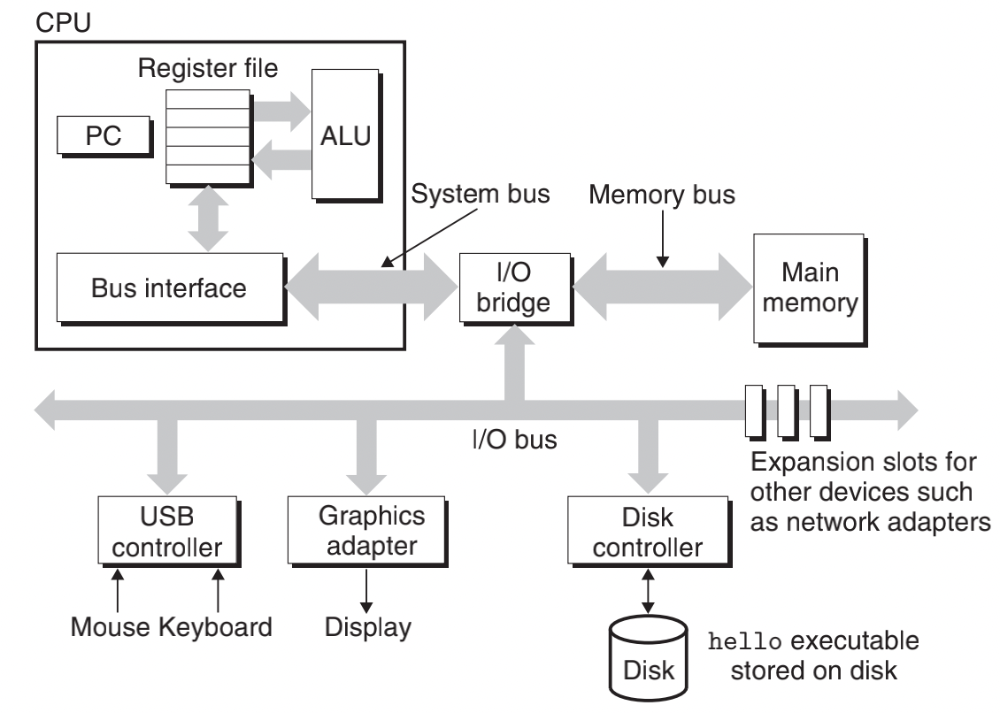

# 计组

> 抱佛脚一时爽，一直抱佛脚一直爽！这篇文章总结常见的计组面试问题~因为是抱佛脚，所以结构上没有什么逻辑...
>
> 参考资料：csapp

## 计算机整体架构

## 计算机硬件系统结构

### 总线（bus）

- carry a word（一个word由固定数量的byte组成） of information back and forth between the components
- Most machines today have word sizes of either 4 bytes (32 bits) or 8 bytes (64 bits)

### i/o设备

- 每个i/o设备都由一个适配器（adapter）或一个控制器（controller）连接到i/o总线上

- 控制器：chip sets in the device itself or on the system’s main printed circuit board (often called

  the *motherboard*，主板)

- 适配器：a card that plugs into a slot on the motherboard

### 主存（main memory）

-  Physically, main memory consists of a collection of *dynamic random access memory* (DRAM) chips
- Logically, memory is organized as a linear array of bytes, each with its own unique address；地址的长度=word的大小

### cpu（central processing unit，或者就叫processor）

- 程序计数器（program counter）：cpu核心的一个word-size寄存器；At any point in time, contains the address of some machine-language instruction in main memory

- 只要有电， a processor repeatedly executes the instruction pointed at by the program counter and updates the program counter to point to the next instruction

- 指令集（instruction set architecture）：pc每次包含一条指令，该指令=一系列步骤；下图是一些指令栗子：

  

- 寄存器堆（register file）： a small storage device that consists of a collection of word-size registers, each with its own unique name

- 逻辑计算单元（ALU, arithmetic/logic unit）：computes new data and address values

- cpu中还有l1~l3缓存，通过*static random access memory*（SRAM）实现

