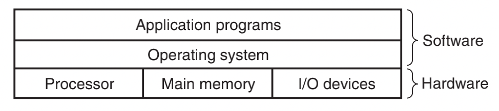
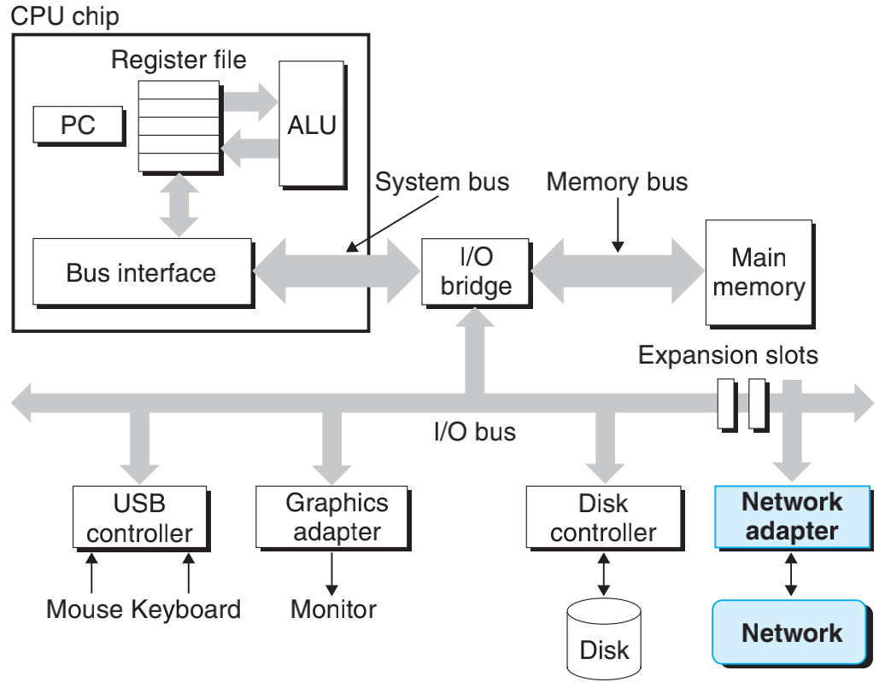
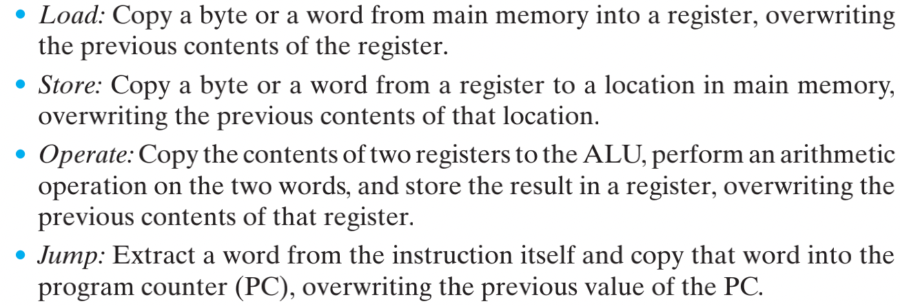

# 计组（基于csapp，含os内容）

> 抱佛脚一时爽，一直抱佛脚一直爽！这篇文章总结常见的计组面试问题~因为是抱佛脚，所以结构上没有什么逻辑...
>
> 参考资料：csapp

## 第一章 概述

### 计算机整体架构

### 计算机硬件系统结构

#### 总线（bus）

- carry a word（一个word由固定数量的byte组成） of information back and forth between the components
- Most machines today have word sizes of either 4 bytes (32 bits) or 8 bytes (64 bits)

#### i/o设备

- 每个i/o设备都由一个适配器（adapter）或一个控制器（controller）连接到i/o总线上

- 控制器：chip sets in the device itself or on the system’s main printed circuit board (often called

  the *motherboard*，主板)

- 适配器：a card that plugs into a slot on the motherboard

#### 主存（main memory）

-  Physically, main memory consists of a collection of *dynamic random access memory* (DRAM) chips
- Logically, memory is organized as a linear array of bytes；每个byte有它的地址，地址的长度=word的大小
- Most 64-bit machines can also run programs compiled for use on 32-bit machines, a form of backward compatibility，反之则不可（注意：是32位program还是64位program取决于编译的方式，而不是取决于在哪种机器上编译的）

#### cpu（central processing unit，或者就叫processor）

- 程序计数器（program counter）：cpu核心的一个word-size寄存器；At any point in time, contains the address of some machine-language instruction in main memory

- 只要有电， a processor repeatedly executes the instruction pointed at by the program counter and updates the program counter to point to the next instruction

- 指令集（instruction set architecture）：pc每次包含一条指令，该指令=一系列步骤；下图是一些指令栗子：

  

- 寄存器堆（register file）： a small storage device that consists of a collection of word-size registers, each with its own unique name

- 逻辑计算单元（ALU, arithmetic/logic unit）：computes new data and address values

- cpu中还有l1~l3缓存，通过*static random access memory*（SRAM）实现

### 关于内核（kernel）

- the portion of the operating system code that is always resident in memory；it is a collection of code and data structures that the system uses to manage all the processes
- When an application program requires some action by the operating system, such as to read or write a fifile, it executes a special *system call* instruction, transferring control to the kernel

### 并行

- 线程级别的并行：多核cpu，同时执行多个线程
- 指令级别的并行：cpu同时执行多个指令
- SIMD（single-instruction, multiple-data）级别的并行：a single instruction causes multiple operations to be performed in parallel

## 第二章 表示和操作信息

### data size

- 在32位和64位program中，相同数据类型的大小可能是不同的（比如long在32位是4byte，而在64位是8byte），因此 ISO C99 introduced a class of data types where the data sizes are fixed regardless of compiler and machine settings. Among these are data types int32_t and int64_t
- 